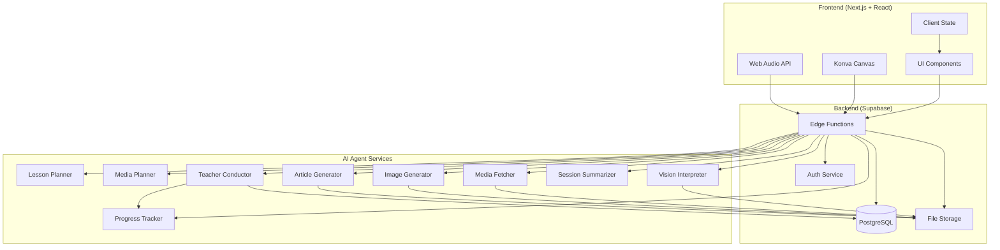
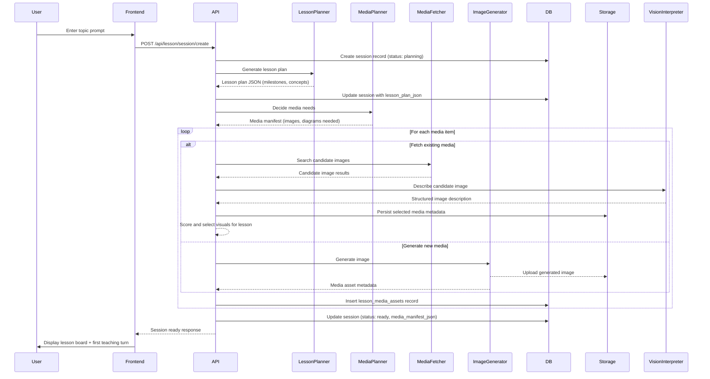
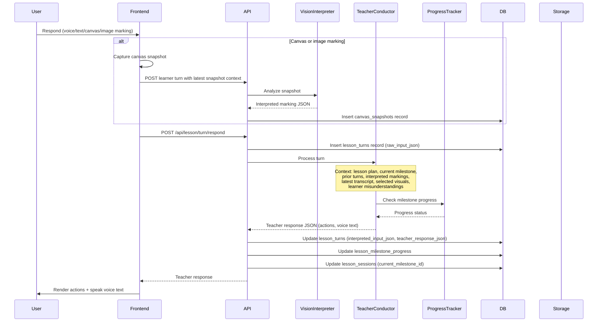

# Design Document: AI Teaching Platform

## Overview

The AI Teaching Platform is a voice-first, agentic web application that provides interactive, personalized teaching experiences for any topic. The system employs a plan-first architecture where lesson planning occurs before teaching begins, enabling structured, goal-oriented instruction. The platform uses a backend-authoritative state model with multiple specialized AI agents coordinating to deliver multimodal teaching experiences through voice, text, canvas interactions, and visual media.

**Inspired by zo app architecture**: The design incorporates proven patterns from the zo educational platform, including:
- **Command-based canvas runtime**: Backend returns structured canvas commands (spawn_objects, add_drop_zones, show_number_line, etc.) that frontend executes deterministically
- **Voice turn policy**: Intelligent microphone management with barge-in support, voice activity detection (VAD), and automatic turn continuation
- **Mastery-based progression**: Track learner mastery per milestone with accuracy thresholds and retry limits
- **Compiled teaching specs**: Structured task definitions with expected answer types, interaction modes, and validation contracts
- **Personalization context**: Adaptive teaching based on learner history, misconceptions, and preferred learning styles

The architecture separates concerns into distinct agents: lesson planning, media preparation (planning, fetching, generation), vision interpretation for learner markings, teaching orchestration, progress tracking, and session summarization. The frontend renders teaching state and captures learner inputs (voice, text, canvas drawings, image annotations), while the backend maintains authoritative state and orchestrates all teaching decisions. This design ensures consistent teaching logic, enables sophisticated multimodal understanding, and supports reliable progress tracking toward learning milestones.

The system is built on Next.js (App Router), React, TypeScript, and Tailwind for the frontend, with Supabase providing authentication, PostgreSQL database, file storage, and Edge Functions for backend logic. AI services integrate with the backend through structured APIs, enabling the platform to interpret complex learner inputs and generate contextually appropriate teaching responses.

## Technical Stack

### AI Models

**Primary Teaching Model (Teacher Conductor, Lesson Planner, Session Summarizer, Article Generator):**
- **Model**: `moonshotai/kimi-k2.5:nitro` via OpenRouter
- **Rationale**: Strong reasoning for lesson planning and live tutoring with configurable OpenRouter routing
- **Temperature**: 0.7 for teaching, 0.3 for planning
- **Max Tokens**: 2000 for teaching turns, 4000 for planning/summarization

**Vision Model (Vision Interpreter):**
- **Model**: `google/gemini-2.5-flash-lite` via OpenRouter
- **Rationale**: Fast multimodal understanding for canvas/image interpretation and search-image description
- **Temperature**: 0.3 for deterministic interpretation
- **Max Tokens**: 1000

**Image Generation (Image Generator):**
- **Model**: DALL-E 3 or Stable Diffusion
- **Rationale**: Generate educational diagrams and visual aids
- **Quality**: Standard (faster generation)

### Voice Services

**Text-to-Speech (Teacher Voice Output):**
- **Service**: ElevenLabs TTS API
- **Model**: Eleven Flash v2.5 (fastest, lowest latency)
- **Voice**: `hpp4J3VqNfWAUOO0d1Us`
- **Settings**:
  - Stability: 0.5 (balanced)
  - Similarity Boost: 0.75 (natural)
  - Style: 0.0 (neutral teaching tone)
  - Use Speaker Boost: true

**Speech-to-Text (Learner Voice Input):**
- **Service**: ElevenLabs Scribe
- **Model**: Scribe V2 Realtime
- **Features**:
  - Real-time transcription with partial and committed transcripts
  - Automatic punctuation
  - Browser-based with single-use token security
  - Low-latency streaming transcription

**Voice Activity Detection (VAD):**
- **Implementation**: `@ricky0123/vad-react` with Silero VAD assets in the browser
- **Purpose**: Detect when learner starts/stops speaking for barge-in support and teacher audio interruption

### Media Preparation Services

**Image Search:**
- **Service**: Serper Google Images API
- **Purpose**: Gather candidate teaching visuals before or during lesson preparation
- **Selection Logic**: Filter by image availability, teachability, and clutter score

**Image Description:**
- **Service**: OpenRouter multimodal chat completions
- **Model**: `google/gemini-2.5-flash-lite`
- **Purpose**: Produce structured descriptions of selected visuals so the tutor knows what is on stage

### Frontend Technologies

- **Framework**: Next.js 14+ (App Router)
- **Language**: TypeScript
- **Styling**: Tailwind CSS
- **Canvas**: Konva.js (React Konva)
- **Audio**: Web Audio API + browser VAD + ElevenLabs playback
- **Markdown Rendering**: react-markdown
- **Math Rendering**: KaTeX
- **State Management**: React Context + Server State (React Query)

### Backend Technologies

- **Platform**: Supabase
- **Runtime**: Deno (Edge Functions)
- **Database**: PostgreSQL (Supabase)
- **Storage**: Supabase Storage
- **Authentication**: Supabase Auth
- **Real-time**: Supabase Realtime (optional for live features)

## Architecture



## Sequence Diagrams

### Lesson Start Flow



### Teaching Turn Flow



## Active Demo Runtime Notes

- The active demo flow is guest-first and browser-local for persistence
- The lesson shell has been rewritten toward a zo-style immersive tutor layout
- The tutor runtime uses a central stage for image + canvas work instead of a small side widget
- Learner turns can combine transcript plus latest canvas context in the same request cycle
- Image search is performed through Serper, then described with Gemini Flash Lite before the tutor sees the visual
- OpenRouter is the active configurable provider path
- `moonshotai/kimi-k2.5:nitro` is the primary tutor model
- ElevenLabs remains optional; when `ELEVENLABS_API_KEY` is absent, the app continues in text/canvas mode without blocking lesson usage

### Lesson Completion Flow

```mermaid
sequenceDiagram
    participant User
    participant Frontend
    participant API
    participant TeacherConductor
    participant ProgressTracker
    participant SessionSummarizer
    participant DB
    
    alt All milestones covered
        TeacherConductor->>ProgressTracker: Check all milestones
        ProgressTracker-->>TeacherConductor: All complete
        TeacherConductor->>API: Signal lesson complete
    else User explicitly ends
        User->>Frontend: End lesson button
        Frontend->>API: POST /api/lesson/session/complete
    end
    
    API->>SessionSummarizer: Generate summary
    Note over SessionSummarizer: Context: lesson plan, all turns,<br/>milestone progress, learner performance
    SessionSummarizer-->>API: Summary JSON
    
    API->>DB: Update session (status: completed, summary_json)
    API-->>Frontend: Completion response + summary
    Frontend->>User: Display lesson summary


## Lesson Article Generation

### Overview

After a lesson completes, the system generates a comprehensive article that captures the entire learning experience in a structured, readable format. This article serves as a permanent record of what was taught and learned, similar to how chat platforms save conversation histories.

### Article Generator Agent

**Responsibilities:**
- Synthesize lesson content into a cohesive article
- Embed media assets (images, diagrams) at appropriate positions
- Include formulas, equations, and mathematical notation
- Preserve key concepts, examples, and explanations
- Generate a descriptive title based on lesson topic and content
- Format content as markdown for rich rendering

**Input:**
- Lesson plan with milestones and concepts
- All teaching turns (teacher speech and learner responses)
- Media assets used during lesson (images, diagrams, generated visuals)
- Canvas snapshots showing learner work
- Milestone progress and learner performance data
- Summary JSON from Session Summarizer

**Output:**
- Article markdown file with:
  - Auto-generated title (e.g., "Understanding Photosynthesis - January 15, 2026")
  - Introduction summarizing lesson objectives
  - Structured sections for each milestone/concept
  - Embedded images and diagrams at relevant positions
  - Formulas and equations in LaTeX/markdown math notation
  - Key takeaways and learner achievements
  - Metadata (topic, duration, completion date, milestones covered)

### Article Structure

```markdown
# [Auto-Generated Title]

**Topic:** [Lesson Topic]
**Date:** [Completion Date]
**Duration:** [Session Duration]
**Milestones Covered:** [X/Y]

## Introduction

[Brief overview of what was taught and learned]

## [Milestone 1 Title]

[Explanation of concept with embedded media]


### Key Points
- [Point 1]
- [Point 2]

### Example
[Worked example or demonstration]

## [Milestone 2 Title]

[Content continues...]

## Summary

[What the learner accomplished and next steps]
```

### Data Model Extensions

**lesson_articles table:**
- id (uuid, primary key)
- session_id (uuid, foreign key to lesson_sessions)
- user_id (uuid, foreign key to auth.users)
- title (text) - Auto-generated descriptive title
- article_markdown (text) - Full article content in markdown
- article_storage_path (text) - Path to markdown file in storage
- metadata_json (jsonb) - Topic, duration, milestones, media references
- created_at (timestamp)
- updated_at (timestamp)

**lesson_sessions table updates:**
- article_path (text, nullable) - Path to generated article in storage
- article_generated_at (timestamp, nullable)

### Article Title Generation

Titles follow the pattern: `[Topic] - [Key Concept] - [Date]`

Examples:
- "Understanding Photosynthesis - How Plants Make Food - January 15, 2026"
- "Fractions Fundamentals - Halves and Quarters - January 15, 2026"
- "World War 1 Overview - Causes and Major Events - January 15, 2026"

### Media Embedding Strategy

1. **Images and Diagrams**: Embed using markdown image syntax with storage URLs
2. **Formulas**: Use LaTeX notation wrapped in `$...$` (inline) or `$$...$$` (block)
3. **Canvas Snapshots**: Include learner work as embedded images with captions
4. **Generated Visuals**: Embed at the point where they were introduced in the lesson

### Article Storage

- Articles stored as markdown files in Supabase Storage bucket: `lesson-articles`
- Path format: `{user_id}/{session_id}/article.md`
- Metadata stored in `lesson_articles` table for quick retrieval
- Articles accessible via unique URL for sharing or reviewing

### Lesson History UI

**Lesson History Page** (`/lessons/history`):
- List of all completed lessons with titles and dates
- Thumbnail preview of first image from each lesson
- Quick stats: duration, milestones covered, completion percentage
- Search and filter by topic, date range
- Click to view full article

**Article Viewer** (`/lessons/article/[id]`):
- Render markdown article with proper formatting
- Display embedded images and diagrams
- Render LaTeX formulas
- Show metadata sidebar (topic, date, duration, milestones)
- Options to download as PDF or share link

## Guest-first Demo Addendum

### Access Model

- The active demo flow is guest-first
- Learners enter the app and start a lesson without authentication
- Guest lesson data is persisted locally per browser instead of requiring authenticated backend ownership

### Persistence Model

- Guest sessions, summaries, and generated lesson articles are stored in browser-local persistence
- Lesson history represents this browser's saved lessons
- Cross-device sync is intentionally out of scope for the demo path

### AI Provider Model

- OpenRouter is the active configurable AI provider integration path
- Provider configuration is environment-driven:
  - `OPENROUTER_API_KEY`
  - `OPENROUTER_MODEL` optional
  - `OPENROUTER_BASE_URL` optional
  - `OPENROUTER_HTTP_REFERER` optional
  - `OPENROUTER_APP_NAME` optional

### Voice Fallback

- ElevenLabs remains optional for guest mode
- When `ELEVENLABS_API_KEY` is absent, the app continues in text/canvas mode without blocking lesson usage
