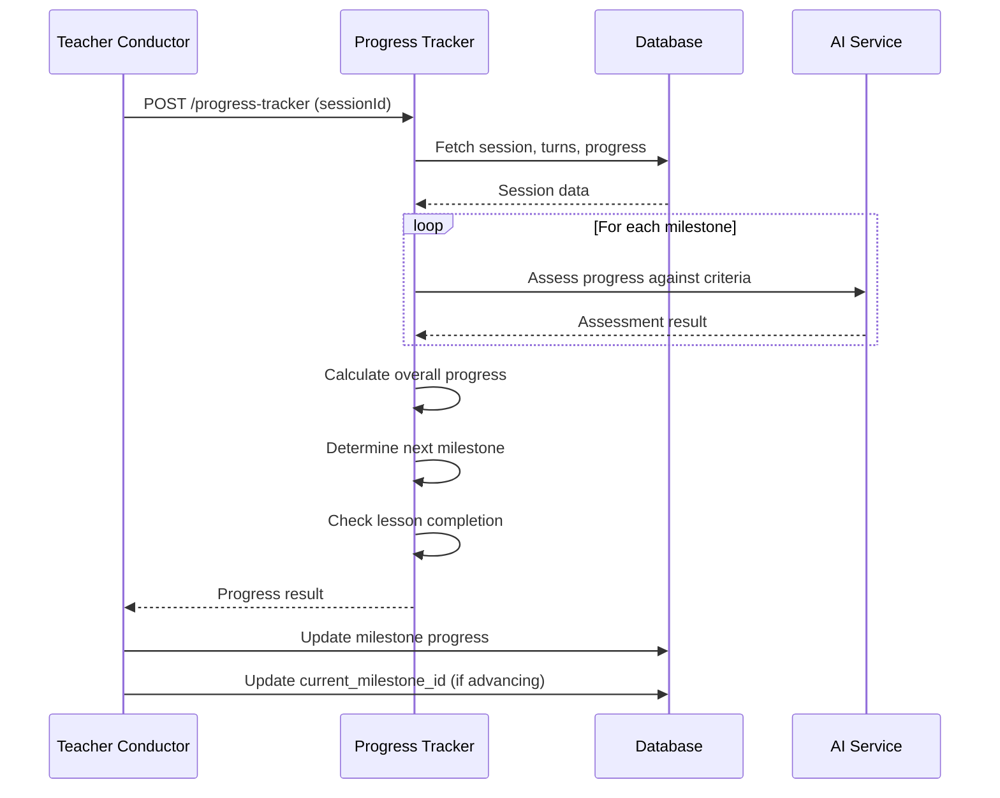

# Progress Tracker Integration Guide

## Overview

This guide explains how to integrate the Progress Tracker Edge Function into the AI Teaching Platform's teaching flow.

## Integration Points

### 1. Teacher Conductor Integration

The Teacher Conductor calls the Progress Tracker during turn processing to assess milestone progress.

**Example Usage in Teacher Conductor:**

```typescript
// After processing learner input
const progressResponse = await fetch(`${supabaseUrl}/functions/v1/progress-tracker`, {
  method: 'POST',
  headers: {
    'Authorization': `Bearer ${supabaseKey}`,
    'Content-Type': 'application/json'
  },
  body: JSON.stringify({
    sessionId: session.id,
    currentMilestoneId: session.current_milestone_id
  })
})

const { result } = await progressResponse.json()

// Use progress assessment to guide teaching decisions
const currentMilestoneProgress = result.allMilestonesProgress.find(
  p => p.milestoneId === result.currentMilestoneId
)

if (currentMilestoneProgress?.shouldAdvance) {
  // Advance to next milestone
  await supabase
    .from('lesson_sessions')
    .update({ current_milestone_id: result.nextMilestoneId })
    .eq('id', sessionId)
}

if (result.shouldCompleteLesson) {
  // Trigger lesson completion
  // Call Session Summarizer
}
```

### 2. Milestone Progress Updates

After each teaching turn, update the milestone progress records based on the assessment.

**Example:**

```typescript
// Update milestone progress in database
for (const progress of result.allMilestonesProgress) {
  await supabase
    .from('lesson_milestone_progress')
    .update({
      status: progress.status,
      evidence_json: {
        attempts: progress.attempts,
        correctAttempts: progress.correctAttempts,
        evidence: progress.evidence
      },
      updated_at: new Date().toISOString()
    })
    .eq('session_id', sessionId)
    .eq('milestone_id', progress.milestoneId)
}
```

### 3. Frontend Progress Display

Use the progress data to update the UI and show learner advancement.

**Example React Component:**

```typescript
import { useEffect, useState } from 'react'

interface ProgressDisplayProps {
  sessionId: string
}

export function ProgressDisplay({ sessionId }: ProgressDisplayProps) {
  const [progress, setProgress] = useState(null)

  useEffect(() => {
    async function fetchProgress() {
      const response = await fetch('/api/agents/progress-tracker', {
        method: 'POST',
        headers: { 'Content-Type': 'application/json' },
        body: JSON.stringify({ sessionId })
      })
      const { result } = await response.json()
      setProgress(result)
    }
    
    fetchProgress()
  }, [sessionId])

  if (!progress) return <div>Loading progress...</div>

  return (
    <div className="progress-tracker">
      <h3>Your Progress</h3>
      <div className="progress-bar">
        <div 
          className="progress-fill" 
          style={{ width: `${progress.overallProgress.percentComplete}%` }}
        />
      </div>
      <p>
        {progress.overallProgress.completedMilestones} of {progress.overallProgress.totalMilestones} milestones completed
      </p>
      
      <div className="milestones">
        {progress.allMilestonesProgress.map(milestone => (
          <div key={milestone.milestoneId} className={`milestone ${milestone.status}`}>
            <span className="milestone-id">{milestone.milestoneId}</span>
            <span className="milestone-status">{milestone.status}</span>
            {milestone.accuracy > 0 && (
              <span className="milestone-accuracy">
                {Math.round(milestone.accuracy * 100)}% accuracy
              </span>
            )}
          </div>
        ))}
      </div>
    </div>
  )
}
```

## Data Flow



## Best Practices

### 1. Call Frequency

- Call Progress Tracker after each learner response turn
- Don't call on teacher-only turns (no new learner input)
- Cache results within a turn to avoid duplicate calls

### 2. Error Handling

```typescript
try {
  const response = await fetch('/api/agents/progress-tracker', {
    method: 'POST',
    headers: { 'Content-Type': 'application/json' },
    body: JSON.stringify({ sessionId })
  })
  
  if (!response.ok) {
    throw new Error(`Progress tracking failed: ${response.status}`)
  }
  
  const { result } = await response.json()
  return result
} catch (error) {
  console.error('Progress tracking error:', error)
  // Fallback: use cached progress or continue without update
  return null
}
```

### 3. Performance Optimization

- Progress tracking involves AI calls, which can take 1-3 seconds
- Consider running progress tracking asynchronously
- Update UI optimistically while waiting for assessment
- Cache progress results for the current turn

### 4. Status Transitions

Ensure status transitions follow the correct flow:
```
not_started → introduced → practiced → covered → confirmed
```

Don't skip statuses or move backwards without good reason.

### 5. Evidence Collection

Accumulate evidence over time:
```typescript
const newEvidence = [
  ...existingProgress.evidence,
  ...assessmentResult.evidence
]

// Limit evidence array size to prevent bloat
const limitedEvidence = newEvidence.slice(-10) // Keep last 10 items
```

## Testing Integration

### Unit Test Example

```typescript
import { assertEquals } from 'https://deno.land/std@0.168.0/testing/asserts.ts'

Deno.test('Progress Tracker Integration - Advance milestone', async () => {
  const mockSessionId = 'test-session-123'
  
  // Mock progress tracker response
  const mockResult = {
    currentMilestoneId: 'm1',
    nextMilestoneId: 'm2',
    allMilestonesProgress: [
      { milestoneId: 'm1', shouldAdvance: true, status: 'confirmed' }
    ]
  }
  
  // Verify advancement logic
  const currentProgress = mockResult.allMilestonesProgress.find(
    p => p.milestoneId === mockResult.currentMilestoneId
  )
  
  assertEquals(currentProgress?.shouldAdvance, true)
  assertEquals(mockResult.nextMilestoneId, 'm2')
})
```

### Integration Test Example

```typescript
Deno.test('Progress Tracker Integration - Full flow', async () => {
  // 1. Create test session with lesson plan
  // 2. Add learner turns with responses
  // 3. Call progress tracker
  // 4. Verify progress assessments
  // 5. Verify milestone advancement
  // 6. Verify lesson completion detection
})
```

## Troubleshooting

### Issue: Progress not updating

**Possible causes:**
- Progress Tracker not being called after turns
- Database update failing
- Milestone IDs not matching between lesson plan and progress records

**Solution:**
- Add logging to track Progress Tracker calls
- Verify milestone_id consistency
- Check database constraints and foreign keys

### Issue: Incorrect status transitions

**Possible causes:**
- AI assessment logic not aligned with success criteria
- Insufficient turn history for accurate assessment
- Evidence not being accumulated correctly

**Solution:**
- Review AI prompt and success criteria
- Ensure turn history includes teacher feedback
- Verify evidence_json structure in database

### Issue: Lesson not completing

**Possible causes:**
- Required milestones not marked as confirmed/covered
- shouldCompleteLesson logic not checking correctly
- Milestone status not updating

**Solution:**
- Check that all required milestones have status 'confirmed' or 'covered'
- Verify lesson completion criteria logic
- Review milestone progress records in database

## Related Documentation

- [Progress Tracker README](./README.md)
- [Teacher Conductor Integration](../teacher-conductor/INTEGRATION.md)
- [Design Document](.kiro/specs/ai-teaching-platform/design.md)
- [Requirements Document](.kiro/specs/ai-teaching-platform/requirements.md)
