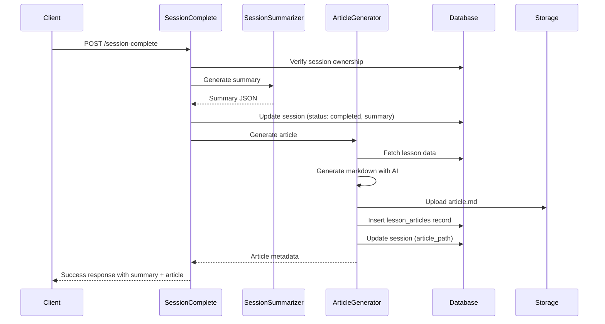

# Session Complete Integration

## Overview

The `session-complete` Edge Function orchestrates the completion of a teaching session by:
1. Generating a comprehensive lesson summary via the Session Summarizer
2. Generating a structured article via the Article Generator
3. Updating the session status to "completed"
4. Returning both summary and article data to the client

## Integration Flow



## Request Format

```typescript
POST /session-complete
Authorization: Bearer <user-token>

{
  "sessionId": "uuid"
}
```

## Response Format

### Success Response

```typescript
{
  "success": true,
  "session": {
    "id": "uuid",
    "status": "completed",
    "summary_json": { /* summary data */ },
    "article_path": "user-id/session-id/article.md",
    "article_generated_at": "2024-01-15T10:30:00Z",
    "completed_at": "2024-01-15T10:30:00Z"
  },
  "summary": {
    "sessionId": "uuid",
    "topic": "Photosynthesis",
    "objective": "Understand how plants make food",
    "duration": {
      "startTime": "2024-01-15T10:00:00Z",
      "endTime": "2024-01-15T10:30:00Z",
      "totalMinutes": 30
    },
    "milestonesOverview": {
      "total": 3,
      "completed": 3,
      "percentComplete": 100,
      "milestones": [...]
    },
    "learnerPerformance": { /* performance data */ },
    "interactionSummary": { /* interaction stats */ },
    "keyTakeaways": [...],
    "recommendedNextSteps": [...]
  },
  "article": {
    "id": "uuid",
    "title": "Photosynthesis - How Plants Make Food - January 15, 2024",
    "storagePath": "user-id/session-id/article.md",
    "metadata": {
      "topic": "Photosynthesis",
      "duration": 30,
      "milestonesTotal": 3,
      "milestonesCompleted": 3,
      "difficulty": "beginner",
      "mediaCount": 2
    }
  },
  "message": "Lesson completed successfully"
}
```

### Partial Success (Article Generation Failed)

If article generation fails, the session is still marked as completed:

```typescript
{
  "success": true,
  "session": { /* session data */ },
  "summary": { /* summary data */ },
  "article": null,
  "message": "Lesson completed successfully (article generation failed)",
  "warning": "Article generation failed but lesson was completed"
}
```

## Error Handling

The function implements graceful degradation:

1. **Summary Generation Failure**: Throws error, session not completed
2. **Article Generation Failure**: Logs error, returns success with `article: null`

This ensures that a lesson can always be completed even if article generation fails (e.g., AI service unavailable).

## Database Updates

### lesson_sessions table

```sql
UPDATE lesson_sessions SET
  status = 'completed',
  summary_json = <summary>,
  article_path = <storage_path>,
  article_generated_at = NOW(),
  completed_at = NOW()
WHERE id = <session_id>
```

### lesson_articles table

```sql
INSERT INTO lesson_articles (
  session_id,
  user_id,
  title,
  article_markdown,
  article_storage_path,
  metadata_json
) VALUES (...)
```

## Storage

Articles are stored in the `lesson-articles` bucket:
- Path: `{user_id}/{session_id}/article.md`
- Content-Type: `text/markdown`
- Upsert: `true` (allows regeneration)

## Requirements Satisfied

This integration satisfies the following requirements:

- **13.1**: Article Generator synthesizes lesson into structured markdown
- **13.5**: Article stored in Supabase Storage at specified path
- **13.6**: Article metadata persisted to lesson_articles table
- **13.7**: Session record updated with article_path and article_generated_at

## Testing

Run tests with:

```bash
deno test supabase/functions/session-complete/index.test.ts --allow-all
```

Tests cover:
- Successful completion with article generation
- Article generator failure handling
- Article structure validation
- Authorization and ownership checks
- Summary generation integration

## Usage Example

```typescript
const response = await fetch(`${supabaseUrl}/functions/v1/session-complete`, {
  method: 'POST',
  headers: {
    'Authorization': `Bearer ${userToken}`,
    'Content-Type': 'application/json'
  },
  body: JSON.stringify({ sessionId: 'session-uuid' })
})

const { success, summary, article } = await response.json()

if (success) {
  console.log('Lesson completed!')
  console.log('Summary:', summary.keyTakeaways)
  
  if (article) {
    console.log('Article:', article.title)
    console.log('View at:', article.storagePath)
  }
}
```

## Related Functions

- **session-summarizer**: Generates lesson summary
- **article-generator**: Generates markdown article
- **session-create**: Creates initial session
- **turn-respond**: Handles teaching turns
