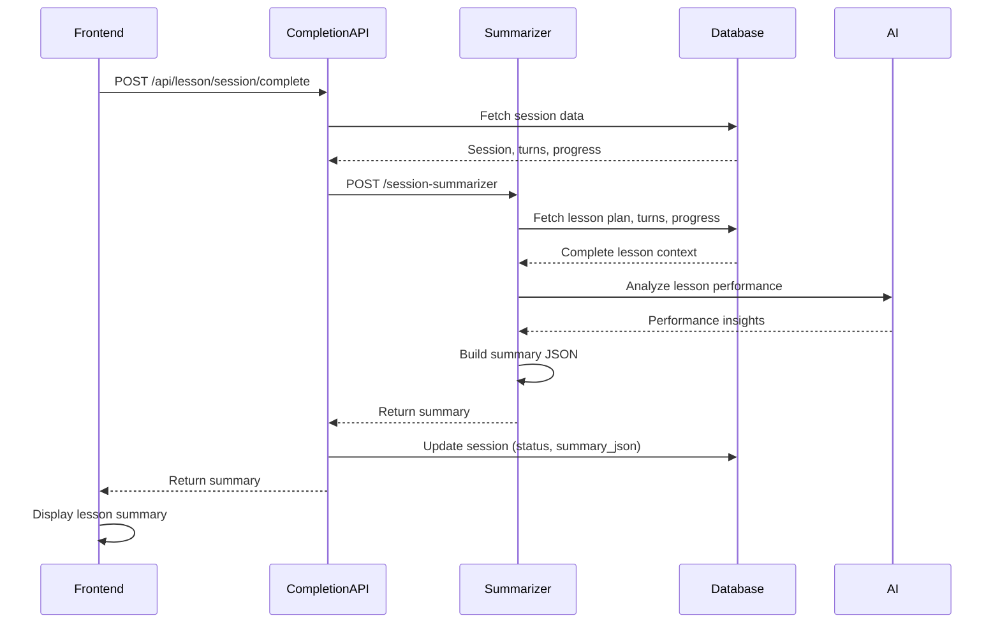

# Session Summarizer Integration Guide

## Overview

This guide explains how to integrate the Session Summarizer Edge Function into the AI Teaching Platform's lesson completion workflow.

## Integration Points

### 1. Lesson Completion Endpoint

The Session Summarizer is invoked by the `/api/lesson/session/complete` Edge Function when a lesson ends.

**Integration Flow:**

```typescript
// In lesson completion endpoint
async function completeLesson(sessionId: string) {
  // 1. Verify session is ready for completion
  const session = await getSession(sessionId)
  if (session.status !== 'active' && session.status !== 'ready') {
    throw new Error('Session cannot be completed')
  }

  // 2. Invoke Session Summarizer
  const summaryResponse = await fetch(
    `${supabaseUrl}/functions/v1/session-summarizer`,
    {
      method: 'POST',
      headers: {
        'Content-Type': 'application/json',
        'Authorization': `Bearer ${supabaseAnonKey}`,
      },
      body: JSON.stringify({ sessionId })
    }
  )

  if (!summaryResponse.ok) {
    throw new Error('Failed to generate lesson summary')
  }

  const { summary } = await summaryResponse.json()

  // 3. Update session with summary and completion status
  await supabase
    .from('lesson_sessions')
    .update({
      status: 'completed',
      summary_json: summary,
      completed_at: new Date().toISOString()
    })
    .eq('id', sessionId)

  // 4. Return completion response to frontend
  return {
    success: true,
    summary,
    message: 'Lesson completed successfully'
  }
}
```

### 2. Teacher Conductor Integration

The Teacher Conductor can signal lesson completion, triggering the summarizer:

```typescript
// In teacher-conductor function
if (teacherResponse.shouldCompleteLesson || progressResult.shouldCompleteLesson) {
  // Mark session for completion
  await supabase
    .from('lesson_sessions')
    .update({
      status: 'completed',
      completed_at: new Date().toISOString()
    })
    .eq('id', sessionId)

  // Trigger summary generation (can be async)
  fetch(`${supabaseUrl}/functions/v1/session-summarizer`, {
    method: 'POST',
    headers: {
      'Content-Type': 'application/json',
      'Authorization': `Bearer ${supabaseAnonKey}`,
    },
    body: JSON.stringify({ sessionId })
  }).catch(error => {
    console.error('Failed to generate summary:', error)
    // Don't fail the teaching turn if summary generation fails
  })
}
```

### 3. Frontend Display

Display the summary to the learner after lesson completion:

```typescript
// In lesson completion component
async function handleLessonComplete(sessionId: string) {
  const response = await fetch('/api/lesson/session/complete', {
    method: 'POST',
    headers: { 'Content-Type': 'application/json' },
    body: JSON.stringify({ sessionId })
  })

  const { summary } = await response.json()

  // Display summary to learner
  return (
    <LessonSummary
      topic={summary.topic}
      duration={summary.duration}
      milestonesCompleted={summary.milestonesOverview.completed}
      totalMilestones={summary.milestonesOverview.total}
      engagement={summary.learnerPerformance.overallEngagement}
      strengths={summary.learnerPerformance.strengthAreas}
      improvements={summary.learnerPerformance.improvementAreas}
      achievements={summary.learnerPerformance.notableAchievements}
      keyTakeaways={summary.keyTakeaways}
      nextSteps={summary.recommendedNextSteps}
    />
  )
}
```

## Data Flow



## Database Schema

The summary is stored in the `lesson_sessions` table:

```sql
-- lesson_sessions table
CREATE TABLE lesson_sessions (
  id UUID PRIMARY KEY,
  user_id UUID NOT NULL,
  topic_prompt TEXT NOT NULL,
  status TEXT NOT NULL, -- 'completed' after summarization
  lesson_plan_json JSONB,
  summary_json JSONB, -- Stores the generated summary
  completed_at TIMESTAMPTZ, -- Set when lesson completes
  created_at TIMESTAMPTZ NOT NULL,
  updated_at TIMESTAMPTZ NOT NULL
);
```

## Error Handling

### Graceful Degradation

If summary generation fails, the lesson should still complete:

```typescript
try {
  const summary = await generateSummary(sessionId)
  await updateSession(sessionId, { status: 'completed', summary_json: summary })
} catch (error) {
  console.error('Summary generation failed:', error)
  // Still mark lesson as completed, but without summary
  await updateSession(sessionId, { 
    status: 'completed',
    summary_json: { error: 'Summary generation failed' }
  })
}
```

### Retry Logic

For transient failures, implement retry with exponential backoff:

```typescript
async function generateSummaryWithRetry(sessionId: string, maxRetries = 3) {
  for (let attempt = 0; attempt < maxRetries; attempt++) {
    try {
      return await generateSummary(sessionId)
    } catch (error) {
      if (attempt === maxRetries - 1) throw error
      await new Promise(resolve => setTimeout(resolve, 1000 * Math.pow(2, attempt)))
    }
  }
}
```

## Performance Optimization

### Async Summary Generation

For better user experience, generate summaries asynchronously:

```typescript
// Complete lesson immediately
await supabase
  .from('lesson_sessions')
  .update({ status: 'completed', completed_at: new Date().toISOString() })
  .eq('id', sessionId)

// Generate summary in background
generateSummaryAsync(sessionId).catch(console.error)

// Return to user immediately
return { success: true, message: 'Lesson completed' }
```

### Caching

Cache summaries to avoid regeneration:

```typescript
async function getSummary(sessionId: string) {
  // Check if summary already exists
  const { data: session } = await supabase
    .from('lesson_sessions')
    .select('summary_json')
    .eq('id', sessionId)
    .single()

  if (session?.summary_json) {
    return session.summary_json
  }

  // Generate if not cached
  return await generateSummary(sessionId)
}
```

## Testing Integration

### Unit Test Example

```typescript
import { describe, it, expect, vi } from 'vitest'

describe('Lesson Completion with Summary', () => {
  it('should generate summary on lesson completion', async () => {
    const sessionId = 'test-session-123'
    
    // Mock summarizer response
    const mockSummary = {
      sessionId,
      topic: 'Test Topic',
      milestonesOverview: { completed: 2, total: 3 },
      learnerPerformance: { overallEngagement: 'high' }
    }

    vi.mock('fetch', () => ({
      default: vi.fn().mockResolvedValue({
        ok: true,
        json: async () => ({ success: true, summary: mockSummary })
      })
    }))

    const result = await completeLesson(sessionId)
    
    expect(result.success).toBe(true)
    expect(result.summary).toEqual(mockSummary)
  })
})
```

### Integration Test Example

```typescript
describe('End-to-End Lesson Completion', () => {
  it('should complete lesson and generate summary', async () => {
    // Create test session
    const session = await createTestSession()
    
    // Simulate teaching turns
    await simulateTeachingTurns(session.id, 10)
    
    // Complete lesson
    const response = await fetch('/api/lesson/session/complete', {
      method: 'POST',
      body: JSON.stringify({ sessionId: session.id })
    })
    
    const { summary } = await response.json()
    
    // Verify summary structure
    expect(summary.sessionId).toBe(session.id)
    expect(summary.milestonesOverview).toBeDefined()
    expect(summary.learnerPerformance).toBeDefined()
    expect(summary.keyTakeaways.length).toBeGreaterThan(0)
    
    // Verify database update
    const updatedSession = await getSession(session.id)
    expect(updatedSession.status).toBe('completed')
    expect(updatedSession.summary_json).toEqual(summary)
  })
})
```

## Monitoring and Logging

### Key Metrics to Track

- Summary generation success rate
- Average generation time
- AI API latency
- Error rates by type
- Summary quality metrics (based on user feedback)

### Logging Example

```typescript
console.log(`[Session Summarizer] Starting summary generation for session ${sessionId}`)
console.log(`[Session Summarizer] Fetched ${turns.length} turns and ${milestoneProgress.length} milestones`)
console.log(`[Session Summarizer] AI analysis completed in ${duration}ms`)
console.log(`[Session Summarizer] Summary generated: ${summary.milestonesOverview.completed}/${summary.milestonesOverview.total} milestones completed`)
```

## Best Practices

1. **Always validate session status** before generating summary
2. **Handle AI API failures gracefully** - don't block lesson completion
3. **Cache summaries** to avoid unnecessary regeneration
4. **Log all summary generations** for debugging and analytics
5. **Provide fallback UI** if summary is unavailable
6. **Test with various lesson lengths** to ensure performance
7. **Monitor AI costs** as summaries can be token-intensive

## Troubleshooting

### Summary Generation Fails

**Symptom**: 500 error from summarizer endpoint

**Possible Causes**:
- Session not found or not completed
- Missing lesson plan data
- AI API key not configured
- AI API rate limit exceeded

**Solution**:
```typescript
// Check session exists and is completed
const session = await getSession(sessionId)
if (!session) throw new Error('Session not found')
if (session.status !== 'completed') throw new Error('Session not completed')

// Verify AI API key is configured
if (!process.env.OPENAI_API_KEY && !process.env.ANTHROPIC_API_KEY) {
  throw new Error('No AI API key configured')
}
```

### Summary Quality Issues

**Symptom**: Generated summaries are generic or inaccurate

**Possible Causes**:
- Insufficient turn data
- Missing milestone progress
- AI prompt needs refinement

**Solution**:
- Ensure all turns are properly recorded
- Verify milestone progress is tracked accurately
- Adjust AI prompt for better context understanding

## Next Steps

After integrating the Session Summarizer:

1. Implement the Article Generator (Task 28.1) to create markdown articles from summaries
2. Build the lesson history UI (Task 31) to display past lesson summaries
3. Add analytics dashboard to track learner progress over time
4. Implement summary sharing and export features
